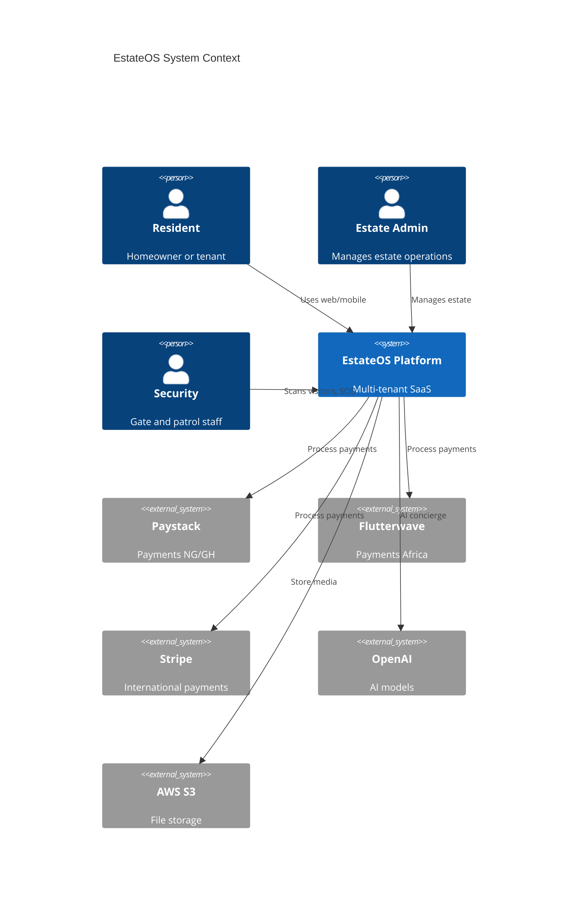

# EstateOS — Functional Specification

**Version:** 1.0.0  
**Companion to:** [PRD.md](./PRD.md)

---

## 1. System Context



---

## 2. Multi-Tenant Data Model

Every tenant-scoped entity carries `estate_id` (UUID, FK → `estates.id`).

### 2.1 Isolation Rules

1. **API Layer:** `TenantMiddleware` extracts estate from JWT claim or `X-Estate-ID` header; rejects cross-tenant access.
2. **ORM Layer:** `TenantQuerySet` auto-filters by active estate.
3. **Super Admin:** Bypass with `platform.super_admin` permission; all actions logged to `audit_logs`.
4. **Soft Deletes:** `deleted_at` timestamp; excluded from default queries.

### 2.2 Tenant Provisioning Flow

```
Super Admin creates Estate
  → Default roles seeded
  → Estate Admin invited
  → Estate Admin configures units, fees, integrations
  → Residents invited/onboarded
```

---

## 3. Module Specifications

### 3.1 Authentication & Authorization

#### 3.1.1 Login Flows

**Email + Password**
```
POST /api/v1/auth/login/
{ email, password, estate_slug? }
→ { access_token, refresh_token, user, estates[] }
```

**Phone OTP**
```
POST /api/v1/auth/otp/request/  { phone, channel: "sms" }
POST /api/v1/auth/otp/verify/     { phone, code }
```

**OAuth (Google/Apple)**
```
GET  /api/v1/auth/oauth/{provider}/authorize/
POST /api/v1/auth/oauth/{provider}/callback/
```

**MFA**
```
POST /api/v1/auth/mfa/setup/     → QR code + backup codes
POST /api/v1/auth/mfa/verify/    { totp_code }
POST /api/v1/auth/mfa/disable/   { password, totp_code }
```

#### 3.1.2 Session & Device Management

- Sessions stored in Redis with device fingerprint, IP, user agent
- `GET /api/v1/auth/sessions/` — list active sessions
- `DELETE /api/v1/auth/sessions/{id}/` — revoke session
- Push tokens linked to devices for mobile notifications

#### 3.1.3 RBAC

Permission format: `{app}.{resource}.{action}`

Examples:
- `visitors.pass.create`
- `billing.invoice.approve`
- `security.incident.assign`

Role assignments are estate-scoped except `super_admin`.

---

### 3.2 Resident Management

#### 3.2.1 Onboarding State Machine

```
INVITED → PENDING_VERIFICATION → ACTIVE → MOVED_OUT
```

#### 3.2.2 Entities

| Entity | Key Fields |
|--------|------------|
| ResidentProfile | user_id, estate_id, unit_id, type (owner/tenant), status |
| FamilyMember | resident_id, name, relationship, access_level |
| DomesticStaff | resident_id, name, id_number, access_schedule (JSON) |
| Vehicle | resident_id, plate, make, model, color, parking_slot_id |

#### 3.2.3 Business Rules

- One primary resident per unit (configurable: allow co-owners)
- Family members inherit gate access policy from primary
- Domestic staff access windows enforced at gate scan
- Vehicle count limit per estate policy

---

### 3.3 Visitor Management

#### 3.3.1 Visitor Pass Types

| Type | Access Method | Validity |
|------|---------------|----------|
| QR Pass | QR scan at gate | Single or multi-entry, time-bound |
| OTP Pass | 6-digit code | Single entry, 24h default |
| Delivery Pass | QR + courier name | 2h default |
| Recurring Guest | QR | Weekly schedule |

#### 3.3.2 Gate Scan Workflow

```
Security scans QR
  → Validate pass (estate, expiry, blacklist)
  → Log entry (timestamp, gate_id, security_user_id)
  → Notify resident (push/in-app)
  → Display: name, host unit, photo, vehicle
```

#### 3.3.3 Blacklist

- Block by phone, name, plate, or pass ID
- Blacklist check on every scan
- Alert security admin on blacklist match attempt

---

### 3.4 Security Module

#### 3.4.1 SOS Alert Flow

```
Resident triggers SOS (mobile shake or button)
  → WebSocket broadcast to security channel
  → SMS to on-duty security
  → Location + unit attached
  → Acknowledge → Resolve workflow
  → Audit log + analytics
```

#### 3.4.2 Incident Reporting

Fields: category, severity, location, description, photos[], witnesses[], status (open/investigating/resolved)

#### 3.4.3 Patrol Logs

GPS-tagged checkpoints, scheduled routes, missed checkpoint alerts.

#### 3.4.4 CCTV Integration Architecture

```
CCTV NVR (ONVIF/RTSP)
  → Integration Gateway (webhook/API adapter)
  → EstateOS Event Bus
  → Incident correlation, clip retrieval URL storage
```

---

### 3.5 Billing & Finance

#### 3.5.1 Fee Types

| Fee | Billing Cycle | Auto-generate |
|-----|---------------|---------------|
| Service charge | Monthly | Yes |
| Waste fee | Monthly | Yes |
| Security fee | Monthly | Yes |
| Maintenance levy | Quarterly | Yes |
| Ad-hoc | One-time | Manual |

#### 3.5.2 Invoice Lifecycle

```
DRAFT → ISSUED → PARTIALLY_PAID → PAID → OVERDUE → WRITTEN_OFF
```

#### 3.5.3 Payment Reminders

Event: `invoice.overdue` → Celery task → Email + SMS + WhatsApp (configurable cadence)

#### 3.5.4 Debt Management

Aging report (30/60/90 days), restriction flags (block visitor creation if debt > threshold)

---

### 3.6 Utility Payments

Supported utilities: Electricity (prepaid/postpaid token), Water, Internet, Airtime, Cable TV.

#### 3.6.1 Consumption Analytics

- Monthly consumption charts per unit
- Estate-wide aggregate
- Anomaly detection (spike alerts)

Integration: abstract `UtilityProvider` interface; implementations for local DISCO APIs.

---

### 3.7 Marketplace

#### 3.7.1 Vendor Lifecycle

```
APPLIED → UNDER_REVIEW → APPROVED → SUSPENDED → TERMINATED
```

#### 3.7.2 Order Flow

```
Browse → Add to Cart → Checkout → Payment → Vendor Fulfillment → Delivery → Rating
```

Elasticsearch indexes: products (name, description, category, vendor, estate_id)

---

### 3.8 Pharmacy Module

#### 3.8.1 Prescription Flow

```
Upload prescription (S3, encrypted)
  → Pharmacy partner review
  → Medication order created
  → Payment → Fulfillment → Drug reminder scheduled
```

API integration architecture for partner pharmacies (REST webhook + inventory sync).

---

### 3.9 Healthcare

| Feature | Implementation |
|---------|----------------|
| Hospital locator | Geo-search with Elasticsearch + Google Places fallback |
| Telemedicine | Integration adapter (Zoom Health / local providers) |
| Ambulance | SOS-linked emergency dispatch request |
| Doctor booking | Calendar integration with provider API |
| Medical records | Encrypted storage, consent-based sharing |

---

### 3.10 Facility Booking

Resources: Gym, Tennis Court, Pool, Event Hall.

Rules engine:
- Max bookings per resident per week
- Deposit required for hall
- Blackout dates
- Payment on booking (optional per facility)

---

### 3.11 Maintenance

Ticket states: `OPEN → ASSIGNED → IN_PROGRESS → PENDING_PARTS → RESOLVED → CLOSED`

SLA: priority-based response/resolution targets; breach notifications.

---

### 3.12 Package Management

```
Courier logs package at gate
  → Resident notified
  → QR generated for pickup
  → Resident scans at pickup point
  → Package marked collected
```

---

### 3.13 Parking

- Resident slots assigned to units
- Visitor permits (time-bound, linked to visitor pass)
- EV charging: slot reservation + session billing architecture

---

### 3.14 Community Platform

- Feed: posts, reactions, comments (moderation queue)
- Polls: single/multi choice, estate-scoped visibility
- Announcements: pinned, push to all residents
- Lost & Found: image, location, claim workflow
- Groups: private/public, membership approval
- Messaging: 1:1 and group (WebSocket, E2E architecture optional v2)

---

### 3.15 Transportation

Uber/Bolt deep links + ride verification:
- Resident shares expected arrival
- Gate validates ride plate against visitor pass

---

### 3.16 Analytics Platform

Executive dashboards aggregate:
- Revenue (MRR, collections, outstanding)
- Occupancy (units occupied/vacant)
- Utility consumption trends
- Vendor GMV
- Security incidents & response times
- Visitor volume by gate/hour

Data pipeline: PostgreSQL → materialized views → Redis cache → dashboard API.

---

### 3.17 AI Concierge

#### 3.17.1 RAG Architecture

```
User query
  → Intent classification
  → Vector search (estate FAQ + policies + docs)
  → Context assembly
  → LLM generation (OpenAI)
  → Action execution (book facility, create ticket, etc.)
  → Response with citations
```

Tools available to agent:
- `book_facility(resource, datetime)`
- `search_marketplace(query)`
- `report_incident(description)`
- `get_faq(topic)`

Vector DB: pgvector extension on PostgreSQL (production) with Qdrant option for scale.

---

### 3.18 Predictive Maintenance

ML pipeline (batch + streaming):
- Sensor/manual inspection data ingestion
- Equipment lifecycle tracking
- Prediction model: failure probability within N days
- Alert: `maintenance.predicted_failure` event

---

## 4. Event-Driven Architecture

### 4.1 Event Bus (RabbitMQ)

Exchange: `estateos.events` (topic)

Sample events:
```
user.registered
visitor.checked_in
invoice.issued
payment.completed
sos.triggered
maintenance.sla_breached
```

### 4.2 Consumers

| Consumer | Events | Action |
|----------|--------|--------|
| NotificationWorker | *.* | Route to email/SMS/push |
| AnalyticsWorker | payment.*, visitor.* | Update aggregates |
| AuditWorker | *.* | Write audit_logs |
| AIWorker | maintenance.* | Run predictions |

---

## 5. API Design Principles

- REST API versioned: `/api/v1/`
- WebSocket: `/ws/v1/{channel}/`
- OpenAPI 3.1 via drf-spectacular
- Pagination: cursor-based for large lists
- Idempotency: `Idempotency-Key` header on POST payments
- Error format: RFC 7807 Problem Details

---

## 6. Security Specification

| Control | Implementation |
|---------|----------------|
| Rate limiting | Redis sliding window per IP/user |
| Input validation | DRF serializers + django-bleach |
| SQL injection | ORM only; parameterized raw SQL forbidden |
| XSS | CSP headers, output encoding |
| CSRF | Token for cookie auth; JWT for API |
| Encryption at rest | RDS encryption, S3 SSE-KMS |
| Encryption in transit | TLS 1.3 |
| Audit | Immutable audit_logs table |
| GDPR/NDPR | Data export API, deletion workflow, consent records |

---

## 7. Database Conventions

- Primary keys: UUID v4
- Timestamps: `created_at`, `updated_at` (auto)
- Soft delete: `deleted_at` (nullable)
- Audit: separate `*_audit` tables for critical entities
- Indexing: composite indexes on `(estate_id, status)`, `(estate_id, created_at DESC)`
- Partitioning: `audit_logs`, `visitor_logs` by month (PostgreSQL declarative partitions)

---

## 8. Integration Contracts

### 8.1 Payment Provider Interface

```python
class PaymentProvider(ABC):
    def initialize(self, amount, currency, metadata) -> PaymentIntent
    def verify(self, reference) -> PaymentResult
    def refund(self, reference, amount) -> RefundResult
    def handle_webhook(self, payload, signature) -> WebhookResult
```

Implementations: `PaystackProvider`, `FlutterwaveProvider`, `StripeProvider`.

### 8.2 Notification Provider Interface

```python
class NotificationChannel(ABC):
    def send(self, recipient, template, context) -> DeliveryResult
```

Channels: Email, SMS, WhatsApp, Push, InApp.

---

## 9. WebSocket Channels

| Channel | Subscribers | Events |
|---------|-------------|--------|
| `notifications.{user_id}` | User | New notification |
| `security.{estate_id}` | Security staff | SOS, incidents |
| `gate.{gate_id}` | Gate terminals | Scan results |
| `chat.{conversation_id}` | Participants | Messages |
| `community.{estate_id}` | Residents | New posts |

---

## 10. File Storage

- S3 bucket per environment: `estateos-{env}-media`
- Path pattern: `{estate_id}/{module}/{entity_id}/{filename}`
- Pre-signed URLs for upload/download (15 min expiry)
- Virus scan hook (ClamAV sidecar) before serving

---

## 11. Search (Elasticsearch)

Indexes:
- `products` — marketplace catalog
- `residents` — admin search (PII restricted fields)
- `documents` — AI RAG source documents
- `hospitals` — healthcare locator

All indexes scoped by `estate_id` filter.
