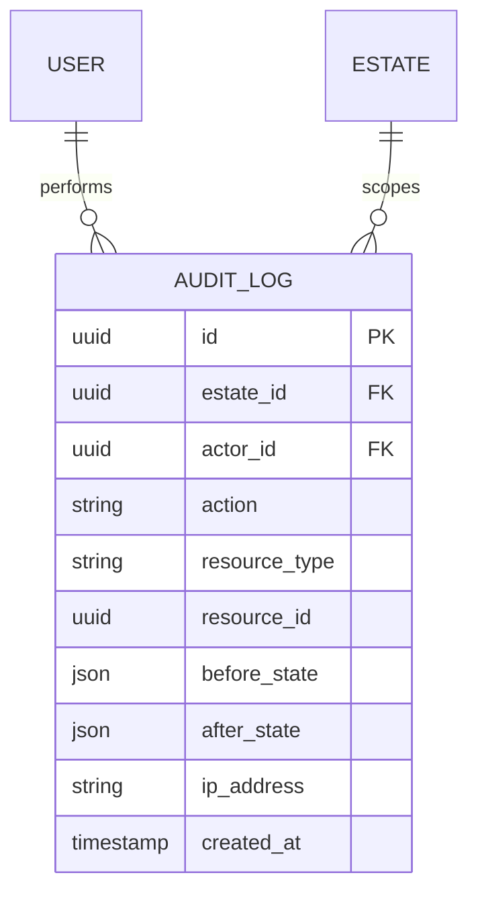
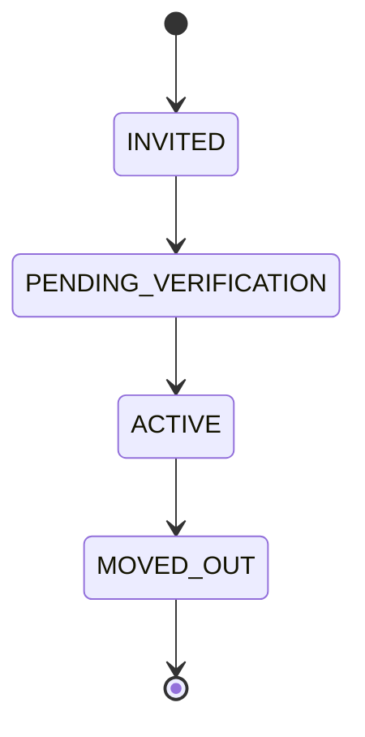
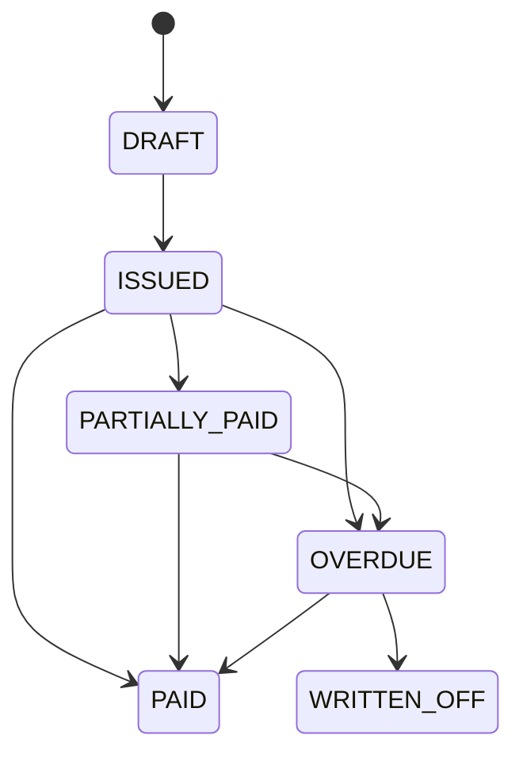
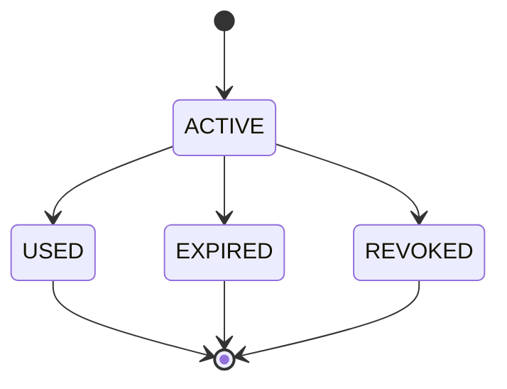

# EstateOS — Entity Relationship Diagram (ERD)

**Version:** 1.0.0

---

## 1. Core Domain ERD

```mermaid
erDiagram
    ESTATE ||--o{ BLOCK : contains
    BLOCK ||--o{ UNIT : contains
    ESTATE ||--o{ USER_ROLE : assigns
    USER ||--o{ USER_ROLE : has
    ROLE ||--o{ USER_ROLE : assigned
    ROLE ||--o{ ROLE_PERMISSION : grants
    PERMISSION ||--o{ ROLE_PERMISSION : granted

    ESTATE ||--o{ RESIDENT_PROFILE : hosts
    USER ||--o| RESIDENT_PROFILE : is
    UNIT ||--o{ RESIDENT_PROFILE : occupied_by
    RESIDENT_PROFILE ||--o{ FAMILY_MEMBER : has
    RESIDENT_PROFILE ||--o{ DOMESTIC_STAFF : employs
    RESIDENT_PROFILE ||--o{ VEHICLE : owns

    ESTATE ||--o{ VISITOR_PASS : issues
    RESIDENT_PROFILE ||--o{ VISITOR_PASS : creates
    VISITOR_PASS ||--o{ VISITOR_LOG : generates
    ESTATE ||--o{ BLACKLIST : maintains

    ESTATE ||--o{ INCIDENT : records
    ESTATE ||--o{ PATROL_LOG : tracks
    ESTATE ||--o{ SOS_ALERT : receives
    ESTATE ||--o{ EMERGENCY_BROADCAST : sends

    ESTATE ||--o{ FEE_TYPE : defines
    ESTATE ||--o{ INVOICE : generates
    UNIT ||--o{ INVOICE : billed_to
    INVOICE ||--o{ INVOICE_LINE : contains
    INVOICE ||--o{ PAYMENT : paid_by
    RESIDENT_PROFILE ||--o{ DEBT_RECORD : accumulates

    ESTATE ||--o{ UTILITY_ACCOUNT : manages
    RESIDENT_PROFILE ||--o{ UTILITY_ACCOUNT : holds
    UTILITY_ACCOUNT ||--o{ UTILITY_TRANSACTION : records
    UTILITY_ACCOUNT ||--o{ CONSUMPTION_RECORD : tracks

    ESTATE ||--o{ VENDOR : approves
    USER ||--o| VENDOR : operates
    VENDOR ||--o{ PRODUCT : lists
    USER ||--o{ CART : has
    CART ||--o{ ORDER : converts
    ORDER ||--o{ REVIEW : receives

    RESIDENT_PROFILE ||--o{ PRESCRIPTION : uploads
    PRESCRIPTION ||--o{ MEDICATION_ORDER : fulfills
    MEDICATION_ORDER ||--o{ DRUG_REMINDER : schedules

    ESTATE ||--o{ HOSPITAL : lists
    RESIDENT_PROFILE ||--o{ APPOINTMENT : books
    RESIDENT_PROFILE ||--o{ AMBULANCE_REQUEST : requests
    RESIDENT_PROFILE ||--o{ MEDICAL_RECORD : owns

    ESTATE ||--o{ FACILITY : operates
    FACILITY ||--o{ BOOKING : schedules
    FACILITY ||--o{ BLACKOUT_DATE : blocks
    RESIDENT_PROFILE ||--o{ BOOKING : makes

    ESTATE ||--o{ SLA_CONFIG : defines
    RESIDENT_PROFILE ||--o{ TICKET : submits
    TICKET ||--o{ TICKET_COMMENT : has
    USER ||--o{ TICKET : assigned

    ESTATE ||--o{ PACKAGE : receives
    UNIT ||--o{ PACKAGE : destined
    PACKAGE ||--o{ PACKAGE_LOG : tracks

    ESTATE ||--o{ PARKING_SLOT : allocates
    UNIT ||--o{ PARKING_SLOT : assigned
    RESIDENT_PROFILE ||--o{ PARKING_PERMIT : holds
    PARKING_SLOT ||--o{ EV_CHARGING_SESSION : hosts

    ESTATE ||--o{ POST : contains
    USER ||--o{ POST : authors
    POST ||--o{ COMMENT : has
    ESTATE ||--o{ POLL : runs
    ESTATE ||--o{ ANNOUNCEMENT : publishes
    ESTATE ||--o{ LOST_FOUND : tracks
    ESTATE ||--o{ GROUP : manages
    GROUP ||--o{ MESSAGE : contains

    RESIDENT_PROFILE ||--o{ RIDE_REQUEST : creates

    ESTATE ||--o{ DASHBOARD_WIDGET : configures
    ESTATE ||--o{ METRIC_SNAPSHOT : aggregates

    ESTATE ||--o{ CONVERSATION : hosts
    USER ||--o{ CONVERSATION : participates
    ESTATE ||--o{ DOCUMENT : stores
    DOCUMENT ||--o{ EMBEDDING : vectorizes
    ESTATE ||--o{ PREDICTION : generates

    USER ||--o{ NOTIFICATION : receives
    USER ||--o{ NOTIFICATION_PREFERENCE : configures
    ESTATE ||--o{ PAYMENT_PROVIDER_CONFIG : configures
    PAYMENT ||--o{ PAYMENT_TRANSACTION : records

    USER ||--o{ USER_SESSION : has
    USER ||--o{ USER_DEVICE : registers
    USER ||--o{ MFA_DEVICE : secures

    ESTATE {
        uuid id PK
        string name
        string slug UK
        string country
        json settings
        string subscription_tier
        timestamp created_at
        timestamp deleted_at
    }

    USER {
        uuid id PK
        string email UK
        string phone UK
        string password_hash
        boolean is_superuser
        boolean mfa_enabled
        timestamp created_at
    }

    UNIT {
        uuid id PK
        uuid estate_id FK
        uuid block_id FK
        string unit_number
        string unit_type
        string status
    }

    RESIDENT_PROFILE {
        uuid id PK
        uuid estate_id FK
        uuid user_id FK
        uuid unit_id FK
        string resident_type
        string status
    }

    VISITOR_PASS {
        uuid id PK
        uuid estate_id FK
        uuid resident_id FK
        string pass_type
        string qr_code UK
        timestamp valid_from
        timestamp valid_until
        string status
    }

    INVOICE {
        uuid id PK
        uuid estate_id FK
        uuid unit_id FK
        string invoice_number UK
        decimal total_amount
        string status
        date due_date
    }

    ORDER {
        uuid id PK
        uuid estate_id FK
        uuid vendor_id FK
        uuid user_id FK
        decimal total_amount
        string status
    }
```



---

## 2. Tenancy Relationships

Every box below the `ESTATE` entity carries `estate_id` as a foreign key:

```
ESTATE (root tenant)
  ├── BLOCK → UNIT
  ├── RESIDENT_PROFILE → FAMILY_MEMBER, VEHICLE, DOMESTIC_STAFF
  ├── VISITOR_PASS → VISITOR_LOG
  ├── INCIDENT, PATROL_LOG, SOS_ALERT
  ├── INVOICE → PAYMENT
  ├── VENDOR → PRODUCT → ORDER
  ├── FACILITY → BOOKING
  ├── TICKET
  ├── POST, POLL, ANNOUNCEMENT, GROUP
  └── All other operational entities
```

**Platform-level entities (no estate_id):**
- `USER` (global identity)
- `ROLE`, `PERMISSION` (platform-defined)
- `USER_ROLE` (scoped via estate_id on junction)
- `PAYMENT_PROVIDER_CONFIG` (estate-scoped)

---

## 3. Audit Entity Relationships



Audit logs are **append-only** (no updates/deletes). Partitioned by month.

---

## 4. Key Cardinality Rules

| Relationship | Cardinality | Rule |
|--------------|-------------|------|
| Estate → Unit | 1:N | Estate has many units |
| Unit → Resident (active) | 1:1 default | One primary resident per unit |
| Resident → VisitorPass | 1:N | Unlimited passes (rate limited) |
| Invoice → Payment | 1:N | Partial payments allowed |
| Vendor → Product | 1:N | Vendor lists many products |
| Order → Review | 1:1 | One review per completed order |
| Facility → Booking | 1:N | Time-slot based, no overlap |
| Ticket → TicketComment | 1:N | Threaded comments |
| Document → Embedding | 1:N | Chunked for RAG |

---

## 5. State Diagrams

### 5.1 Resident Status



### 5.2 Invoice Status



### 5.3 Visitor Pass Status



---

## 6. Index Strategy Summary

See [database-design.md](./database-design.md) for full index definitions.

**High-traffic query patterns:**
- Gate scan: `visitor_pass(qr_code)` — unique index
- Resident lookup: `(estate_id, unit_id, status)` — composite
- Invoice list: `(estate_id, status, due_date)` — composite
- Visitor logs: `(estate_id, created_at DESC)` — composite + partition
- Product search: Elasticsearch (not DB index)
