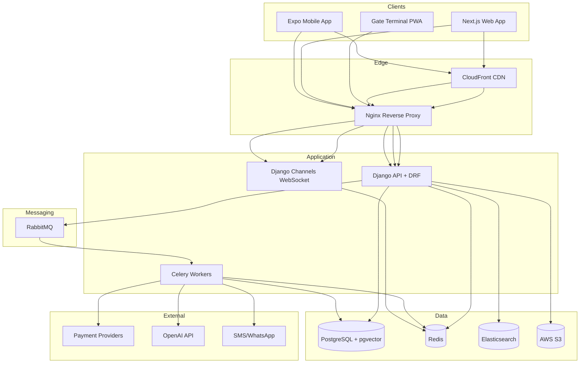
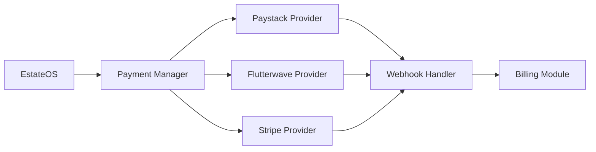

# EstateOS — System Architecture

**Version:** 1.0.0

---

## 1. Architecture Overview

EstateOS follows a **modular monolith** backend with **event-driven** async processing, deployed as containerized services on AWS with horizontal scaling capability.



---

## 2. C4 Container Diagram

| Container | Technology | Responsibility |
|-----------|------------|----------------|
| Web App | Next.js 15, React 19 | Resident/admin dashboards, marketplace, community |
| Mobile App | Expo React Native | Resident mobile, SOS, gate QR, push notifications |
| API Server | Django 5 + Gunicorn/Daphne | REST API, business logic, auth |
| WebSocket Server | Django Channels + Daphne | Real-time notifications, chat, SOS, gate events |
| Worker | Celery | Async tasks: billing, notifications, AI, analytics |
| Scheduler | Celery Beat | Cron: invoice generation, reminders, predictions |
| PostgreSQL | RDS PostgreSQL 16 | Primary data store, pgvector for RAG |
| Redis | ElastiCache | Cache, sessions, rate limits, channel layer |
| RabbitMQ | Amazon MQ | Event bus, task queue |
| Elasticsearch | OpenSearch | Product search, hospital locator, document search |
| S3 | AWS S3 | Media, prescriptions, incident photos |
| Nginx | ECS/Fargate | TLS termination, load balancing, static files |
| CloudFront | AWS CDN | Global static asset delivery |

---

## 3. Multi-Tenant Architecture

### 3.1 Tenancy Strategy: Shared Database, Shared Schema

All tenant data in one PostgreSQL database with `estate_id` column on every tenant-scoped table.

**Advantages:** Cost-efficient, simpler ops, cross-estate analytics for super admin  
**Safeguards:** Middleware enforcement, queryset managers, integration tests, row-level audit

### 3.2 Request Flow

```
HTTP Request
  → Nginx (TLS)
  → TenantMiddleware (extract estate_id from JWT/header/subdomain)
  → AuthenticationMiddleware (JWT validation)
  → RBAC Permission Check
  → View/Serializer (auto-filtered queryset)
  → Response
```

### 3.3 JWT Claims

```json
{
  "sub": "user-uuid",
  "email": "user@example.com",
  "estates": [
    { "id": "estate-uuid", "slug": "palm-heights", "roles": ["resident"] }
  ],
  "active_estate_id": "estate-uuid",
  "permissions": ["visitors.pass.create", "billing.invoice.view"]
}
```

---

## 4. Event-Driven Architecture

### 4.1 Event Flow

```
Domain Action (e.g., payment completed)
  → Django signal / explicit publish
  → RabbitMQ exchange: estateos.events (topic)
  → Celery consumers route by routing key
  → Side effects: notifications, analytics, audit
```

### 4.2 Event Catalog

| Routing Key | Publisher | Consumers |
|-------------|-----------|-----------|
| `user.registered` | accounts | notifications, analytics |
| `visitor.checked_in` | visitors | notifications, analytics |
| `invoice.issued` | billing | notifications, analytics |
| `invoice.overdue` | billing | notifications (reminder) |
| `payment.completed` | payments | billing, notifications, analytics |
| `sos.triggered` | security | notifications (priority), websocket |
| `maintenance.sla_breached` | maintenance | notifications |
| `order.placed` | marketplace | notifications, analytics |
| `prediction.generated` | ai | notifications |

### 4.3 Idempotency

Payment and webhook handlers use `idempotency_key` stored in Redis (24h TTL) to prevent duplicate processing.

---

## 5. Authentication Architecture

```
┌─────────────┐     ┌──────────────┐     ┌─────────────┐
│   Client    │────▶│  Auth API    │────▶│  PostgreSQL │
└─────────────┘     └──────────────┘     └─────────────┘
                           │
                    ┌──────┴──────┐
                    │    Redis    │  Sessions, OTP, rate limits
                    └─────────────┘
                           │
              ┌────────────┼────────────┐
              ▼            ▼            ▼
         Google OAuth  Apple OAuth   SMS OTP
```

- Access token: 15 minutes (JWT, RS256)
- Refresh token: 7 days (rotated on use, stored hashed in DB)
- MFA: TOTP (pyotp) + 10 backup codes

---

## 6. Payment Architecture



Factory pattern selects provider based on estate configuration and currency.

---

## 7. AI / RAG Architecture

```
┌──────────────────────────────────────────────────────────┐
│                     AI Concierge                          │
├──────────────────────────────────────────────────────────┤
│  User Query → Intent Classifier → Tool Router            │
│                    │                                      │
│                    ▼                                      │
│              Vector Search (pgvector)                     │
│              Estate docs + FAQs + policies                │
│                    │                                      │
│                    ▼                                      │
│              Context Assembly → OpenAI GPT-4o             │
│                    │                                      │
│                    ▼                                      │
│              Action Execution (book, order, report)       │
│                    │                                      │
│                    ▼                                      │
│              Response + Citations                         │
└──────────────────────────────────────────────────────────┘
```

**Document ingestion pipeline:**
1. Admin uploads PDF/Markdown → S3
2. Celery task chunks document → OpenAI embeddings
3. Vectors stored in `ai_embedding` table (pgvector)
4. Indexed for cosine similarity search scoped by `estate_id`

---

## 8. WebSocket Architecture

```
Client ←→ Nginx ←→ Daphne (Channels)
                      │
                      ▼
                 Redis Channel Layer
                      │
         ┌────────────┼────────────┐
         ▼            ▼            ▼
   notifications  security.sos   chat.messages
```

**Channels:**
- `ws/v1/notifications/` — user notifications
- `ws/v1/security/{estate_id}/` — SOS, incidents
- `ws/v1/gate/{gate_id}/` — scan results
- `ws/v1/chat/{conversation_id}/` — messaging

---

## 9. Search Architecture

Elasticsearch indexes (per environment):

| Index | Fields | Filter |
|-------|--------|--------|
| `estateos_products` | name, description, category, price | estate_id |
| `estateos_hospitals` | name, address, geo_point | estate_id or global |
| `estateos_documents` | title, content chunks | estate_id |

Sync via Django signals → Celery indexing tasks.

---

## 10. Caching Strategy

| Cache Key Pattern | TTL | Purpose |
|-------------------|-----|---------|
| `estate:{id}:config` | 1h | Estate settings |
| `user:{id}:permissions` | 15m | RBAC permissions |
| `dashboard:{estate}:{role}` | 5m | Dashboard widgets |
| `product:{id}` | 30m | Product detail |
| `rate:{ip}:{endpoint}` | 1m | Rate limiting |

Cache-aside pattern with Redis; invalidation on write via signals.

---

## 11. Security Architecture

| Layer | Control |
|-------|---------|
| Network | VPC, security groups, WAF |
| Transport | TLS 1.3, HSTS |
| Application | OWASP headers, CSP, input validation |
| Auth | JWT, MFA, RBAC, session revocation |
| Data | Encryption at rest (RDS, S3 KMS), field-level encryption for medical records |
| Audit | Immutable audit_logs, CloudTrail |
| Compliance | GDPR/NDPR data export/deletion APIs |

---

## 12. Scalability Design

**Target:** 100+ estates, 1M+ users

| Component | Scaling Strategy |
|-----------|----------------|
| API | Horizontal (ECS auto-scaling on CPU/request count) |
| WebSocket | Horizontal with Redis channel layer |
| Celery Workers | Horizontal by queue (notifications, billing, ai) |
| PostgreSQL | Read replicas, PgBouncer connection pooling |
| Redis | ElastiCache cluster mode |
| Elasticsearch | 3-node cluster with sharding |
| S3 | Unlimited; CloudFront for reads |

**Database partitioning:**
- `audit_logs` — monthly range partitions
- `visitor_logs` — monthly range partitions
- `metric_snapshots` — monthly range partitions

---

## 13. Deployment Topology (AWS)

```
Route 53 → CloudFront → ALB → ECS Fargate
                                ├── nginx (2+ tasks)
                                ├── api (4+ tasks)
                                ├── websocket (2+ tasks)
                                └── celery-worker (4+ tasks)
                           RDS PostgreSQL (Multi-AZ)
                           ElastiCache Redis
                           Amazon MQ (RabbitMQ)
                           OpenSearch
                           S3 + CloudFront
```

Managed by Terraform (see `infrastructure/terraform/`).

---

## 14. Monitoring & Observability

| Tool | Purpose |
|------|---------|
| Prometheus | Metrics collection (API latency, queue depth, DB connections) |
| Grafana | Dashboards (SLA, business metrics) |
| Sentry | Error tracking (backend, frontend, mobile) |
| CloudWatch | AWS infrastructure logs |
| Structured logging | JSON logs with trace_id, estate_id, user_id |

---

## 15. Disaster Recovery

- RDS automated backups (35-day retention)
- S3 versioning + cross-region replication (production)
- RTO: 4 hours | RPO: 1 hour
- Runbook in `docs/phase-09/disaster-recovery.md`
